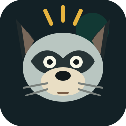

<p align="center">
  
</p>

<h1 align="center">WhileItThinks</h1>

<p align="center">
  <strong>Your AI agent is thinking. Your eyes should rest.</strong><br>
  A local-first macOS wait-state router for Claude Code and Codex.
</p>

<p align="center">
  
  
  
  
</p>

<p align="center">
  <a href="#start-here">Start Here</a> |
  <a href="#what-it-does">What It Does</a> |
  <a href="#architecture">Architecture</a> |
  <a href="#privacy-defaults">Privacy</a> |
  <a href="#development">Development</a>
</p>

## Start Here

Build the local macOS app bundle:

```bash
scripts/build-app.sh
```

Install it where hook paths stay stable:

```bash
ditto dist/WhileItThinks.app /Applications/WhileItThinks.app
open /Applications/WhileItThinks.app
```

In the app:

1. Start the daemon.
2. Enable Claude Code if you use Claude Code CLI or the Claude Desktop Code tab.
3. Enable Codex if you use Codex CLI or Codex Desktop.
4. Allow notifications for completion and approval alerts.
5. For Codex, open Terminal, run `codex`, type `/hooks` in the Codex CLI, review WhileItThinks, and trust the hooks. Codex Desktop does not currently expose the hook browser command in its chat UI.

Accessibility is optional. It is only for active-app/fullscreen suppression work; Claude and Codex wait-state detection does not require it.

## What It Does

WhileItThinks watches real developer wait states instead of running a dumb timer. It listens for Claude Code and Codex lifecycle events, classifies the work that is already making you wait, and shows a tiny local overlay when it is a good moment to look away.

Current launch scope:

| Surface | Support | How it is detected |
| --- | --- | --- |
| Claude Code CLI | High | User-level hooks in `~/.claude/settings.json` |
| Claude Desktop Code tab | High | Shared Claude Code settings and hook system |
| Codex CLI | High | User-level hooks in `~/.codex/hooks.json` |
| Codex Desktop app | High | Shared Codex agent configuration, after one-time hook trust approval from Codex CLI |

VS Code and Cursor are intentionally deferred until the Claude/Codex path is solid.

## Architecture

The desktop app is the user-facing product. The local engine is embedded inside the bundle:

```text
Claude Code hooks
Codex hooks
        |
        v
whileitthinks-hook
        |
        v
whileitthinksd local daemon
        |
        v
wait-state classifier + sanitized SQLite store
        |
        v
WhileItThinks.app overlay, notifications, menu bar state
```

Bundled binaries:

| Binary | Purpose |
| --- | --- |
| `WhileItThinks` | SwiftUI/AppKit desktop app |
| `whileitthinksd` | Local event daemon |
| `whileitthinks-hook` | Fail-open hook bridge called by Claude/Codex |
| `whileitthinks-cli` | Installer, status, guide, and test-event CLI used by the app |

The daemon listens locally on:

- Unix socket: `~/Library/Application Support/WhileItThinks/whileitthinks.sock`
- HTTP: `http://127.0.0.1:47328/v1/events`

## Hook Installation

Check status:

```bash
/Applications/WhileItThinks.app/Contents/MacOS/whileitthinks-cli \
  --hook-path /Applications/WhileItThinks.app/Contents/MacOS/whileitthinks-hook \
  status
```

Install both integrations:

```bash
/Applications/WhileItThinks.app/Contents/MacOS/whileitthinks-cli \
  --hook-path /Applications/WhileItThinks.app/Contents/MacOS/whileitthinks-hook \
  install all
```

Uninstall both integrations:

```bash
/Applications/WhileItThinks.app/Contents/MacOS/whileitthinks-cli \
  --hook-path /Applications/WhileItThinks.app/Contents/MacOS/whileitthinks-hook \
  uninstall all
```

Config writes always parse, back up, merge, validate, and write atomically. Existing Claude and Codex settings are preserved.

## Manual Smoke Tests

Send a synthetic Claude event:

```bash
/Applications/WhileItThinks.app/Contents/MacOS/whileitthinks-cli \
  test-event --source claude-code --event PreToolUse --command "sleep 8"
```

Send a synthetic Codex event:

```bash
/Applications/WhileItThinks.app/Contents/MacOS/whileitthinks-cli \
  test-event --source codex --event PreToolUse --command "pnpm test"
```

Those commands do not contact Claude or Codex. They exercise the same daemon, overlay, notification, sanitizer, and classifier path that real hooks use.

## Privacy Defaults

WhileItThinks stores sanitized metadata only:

- source and surface
- event kind
- timestamp and duration
- exit code
- command category and safe command summary
- hashed project, cwd, session, conversation, and generation identifiers

It does not store raw prompts, assistant text, shell output, file contents, unredacted file paths, email addresses, or raw command arguments by default.

Everything stays on your Mac.

## Development

Run the Rust tests:

```bash
cargo test --all-targets
```

Build the Swift app target:

```bash
swift build -c debug --package-path macos
```

Build the full app bundle:

```bash
scripts/build-app.sh
```

Verify the bundle:

```bash
plutil -lint dist/WhileItThinks.app/Contents/Info.plist
codesign --verify --deep --strict --verbose=1 dist/WhileItThinks.app
```

Useful local files:

| Path | Purpose |
| --- | --- |
| `src/installer.rs` | Claude/Codex config merger and status checks |
| `src/mapper.rs` | Raw hook payload to normalized event mapping |
| `src/wait_state.rs` | Wait-state transition engine |
| `src/classifier.rs` | Command classifier rules |
| `macos/Sources/WhileItThinksApp/WhileItThinksApp.swift` | Desktop UI, overlay, menu bar, permissions |
| `docs/desktop-integration-review.md` | Current compatibility notes and production gaps |

## Production Gaps

- Sign and notarize the app for distribution.
- Replace the app-owned daemon process with a proper login item/helper.
- Add automated smoke scripts for Claude CLI/Desktop and Codex CLI/Desktop on a clean macOS test user.
- Add VS Code and Cursor only after the Claude/Codex path is boringly reliable.
